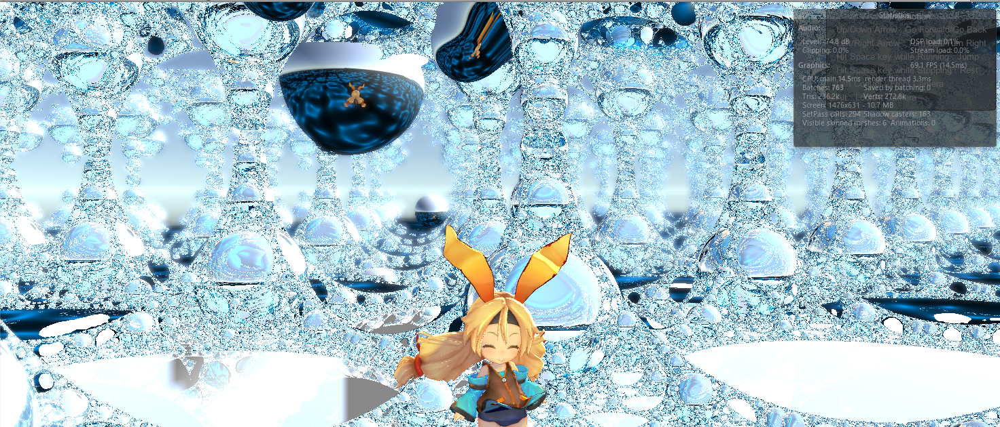

# PsuedoKleinRaymarching

# Tags
`Unity` `ShaderLab`

# Short Description
疑似クライン群アルゴリズムを採用した、Unity上で動くレイマーチングレンダラー

フォワードレンダリングを用いて作成した。

post-processing stack(v2)とUnityChanを利用。

Unity 2018.3.14.fで動作

# Minimal Example

# Contributors
- [すなます](https://github.com/snamas)
